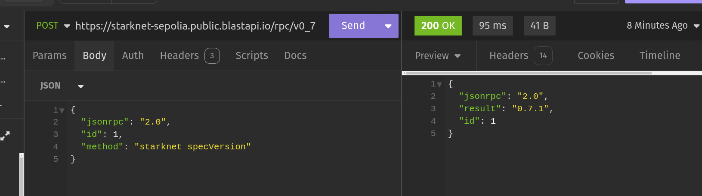

<!-- prettier-ignore-start -->
<!-- markdownlint-disable -->
<div align="center" style="margin-top:50px">
  
</div>
<!-- markdownlint-restore -->
<!-- prettier-ignore-end -->

<h4 align="center">
  <a href="https://www.starksight.app">starksight.app</a>
</h4>

# Starksight

Starksight is a no-loss prediction market that redefines betting. Users place their bets, funds generate yield through Starknet protocols, and only the earnings reward the winners—while losers walk away with their full stake intact. A new era of risk-free wagering begins

[](https://github.com/BlackStarkGoku/StarkSight/pulls)

## Requirements

Before you begin, you need to install the following tools:

- [Node (>= v18.17)](https://nodejs.org/en/download/)
- Yarn ([v1](https://classic.yarnpkg.com/en/docs/install/) or [v2+](https://yarnpkg.com/getting-started/install))
- [Git](https://git-scm.com/downloads)
- [Rust](https://rust-lang.org/tools/install)
- [asdf](https://asdf-vm.com/guide/getting-started.html)
- [Cairo 1.0 extension for VSCode](https://marketplace.visualstudio.com/items?itemName=starkware.cairo1)

### Starknet-devnet version

To ensure the proper functioning of scaffold-stark, your local `starknet-devnet` version must be `0.2.3`. To accomplish this, first check your local starknet-devnet version:

```sh
starknet-devnet --version
```

If your local starknet-devnet version is not `0.2.3`, you need to install it.

- Install Starknet-devnet `0.2.3` via `asdf` ([instructions](https://github.com/gianalarcon/asdf-starknet-devnet/blob/main/README.md)).

### Scarb version

To ensure the proper functioning of scaffold-stark, your local `Scarb` version must be `2.9.2`. To accomplish this, first check your local Scarb version:

```sh
scarb --version
```

If your local Scarb version is not `2.9.2`, you need to install it.

- Install Scarb `2.9.2` via `asdf` ([instructions](https://docs.swmansion.com/scarb/download.html#install-via-asdf)).

### Starknet Foundry version

To ensure the proper functioning of the tests on scaffold-stark, your Starknet Foundry version must be 0.31.0. To accomplish this, first check your Starknet Foundry version:

```sh
snforge --version
```

If your Starknet Foundry version is not `0.34.0`, you need to install it.

- Install Starknet Foundry `0.34.0` via `asdf` ([instructions](https://foundry-rs.github.io/starknet-foundry/getting-started/installation.html#installation-via-asdf)).

## Compatible versions

- Starknet-devnet - v0.2.3
- Scarb - v2.9.2
- Snforge - v0.34.0
- Cairo - v2.9.2
- Rpc - v0.7.1

## Quickstart with Starknet-Devnet

To get started with Starksight, follow the steps below:

1. Clone this repo and install dependencies

```bash
git clone https://github.com/BlackStarkGoku/StarkSight.git
cd StarkSight
yarn install
```

2. Run a local network in the first terminal.

```bash
yarn chain --fork-network <YOUR_MAINNET_RPC_URL>
```

> To run a fork : `You need to update targetNetworks to mainnetFork and isFork to true in scaffold.config.ts`

This command starts a local Starknet network using Devnet.

3. On a second terminal, deploy the BetMaker contract:

```bash
yarn deploy
```

This command deploys the BetMaker smart contract to the local network. The contract is located in `packages/snfoundry/contracts/src` and can be modified to suit your needs. The `yarn deploy` command uses the deploy script located in `packages/snfoundry/scripts-ts/deploy.ts` to deploy the contract to the network. You can also customize the deploy script.

By default `Starksight` takes the first prefunded account from `starknet-devnet` as a deployer address,

4. On a third terminal, start your NextJS app:

```bash
yarn start
```

Visit your app on: `http://localhost:3000`. You can interact with your smart contract using the `Debug Contracts` page.

5. Check your environment variables.

### RPC specific version

To ensure the proper functioning of the scaffold-stark with Testnet or Mainnet, your RPC version must be `0.7.1`. This repository contains a `.env.example` file, where we provided the default RPC URL for the Starknet Testnet: `RPC_URL_SEPOLIA=https://starknet-sepolia.public.blastapi.io/rpc/v0_7`. Let's verify this RPC version is `0.7.1` by calling a `POST` request in an API platform like `Postman` or `Insommia` . Your API endpoint should be `https://starknet-sepolia.public.blastapi.io/rpc/v0_7` and the body should be:

```json
{
 "jsonrpc":"2.0",
 "method":"starknet_specVersion",
 "id":1
}
```

You have to paste the endpoint and body in the API platform and click on the `Send` button. If the response is `0.7.1`, then you are good to go. Otherwise, you have to get the correct RPC URL endpoint.


</details>


## Contributing to Starksight

We welcome contributions to Starksight!

<h4>
  <a href="https://t.me/+VEb3b_6UUBdkN2I0">Telegram</a>
</h4>
